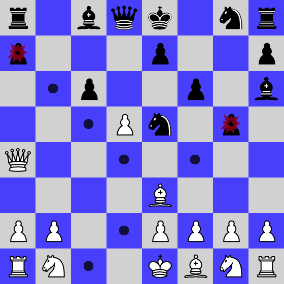

[](https://dev.azure.com/thomassedlmair/ezEngine/_build/latest?definitionId=6&branchName=master)

# ezEngine - 2D Game Engine
  
Welcome to my 2D Game Engine! This game engine is still under development. The long term goal is to create different games by using different interfaces. Aside there will be an artificial intelligence which learns how to play chess (therefore i started implementing a chess game) against human players or another AI. Before starting with AI this will be a coding playground. first of all this will be a independent 2D game engine with an different interfaces (dll, python, lua) and an implemented chess game.
  


## External Libraries

````
sudo apt install libsdl2-dev
sudo apt install libsdl2-image-dev
sudo apt install libsdl2-ttf-dev
sudo apt install libsdl2-mixer-dev
sudo apt install liblua5.3-dev
sudo apt-get install libboost-all-dev
````


## Build & Run
There are different targets in the makefile. 
1. Run `make` to build the engine
2. Run `make install` (if permission denied, run as sudo) to copy the shared library to /usr/lib
3. Run `make chess` to build the chess example
4. Run `make run` or `./chessExample` (if permission denied, run as sudo) to run the example

By running the game the first setup with chess figures will look like: 



  

Next Steps:
- finishing chess implementation 
- refactoring implementation
- adding further basic engine components/systems (fonts, drawing, collision, game control, hud, etc.)
- expand current api
- creating api's
- starting AI

## Python API

First implementation for the python API done. Run `make python_api` to create the python module. Either use default library directory or copy the library `ezEngine_python.so` into `./examples/python` and run the script `python3.8 create_window.py`  to create a simple sdl window (current development state).